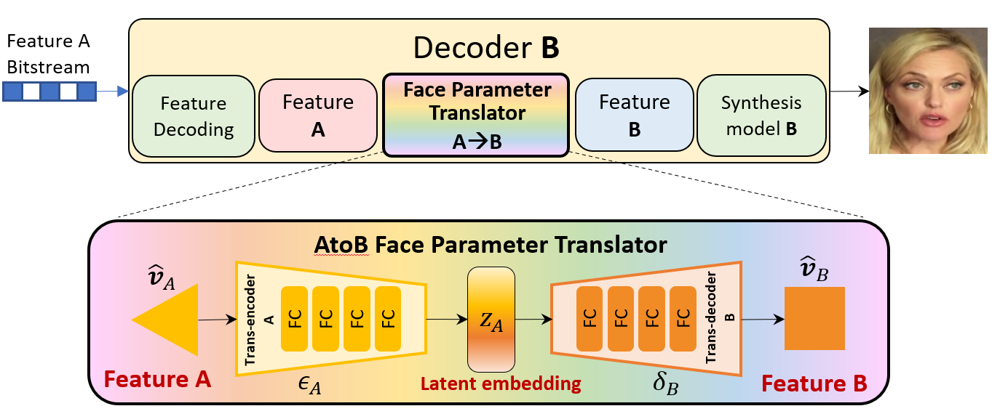

# GFVC_Software-Decoder_Interoperability

+ The code is adapted from [GFVC_Software](https://github.com/Berlin0610/GFVC_Software/tree/main). The GFVC checkpoints and overall testing dataset can be found in this page.
+ With three leading GFVC works, i.e., [FOMM](https://github.com/AliaksandrSiarohin/first-order-model), [CFTE](https://github.com/Berlin0610/CFTE_DCC2022) and [FV2V](https://github.com/zhanglonghao1992/One-Shot_Free-View_Neural_Talking_Head_Synthesis) integrated in GFVC_Software, we use face parameter translator to enable decodeing interoperability for fixed decoder.



## Encoding/Decoding Porcesses
The platform details can be described as follows,
-	The pretrained analysis/synthesis models and codes of the three representative GFVC algorithms are encapsulated in the `GFVC` folder. 
-	The corresponding interfaced functions regarding the encoder and decoder are defined in `CFTE_Encoder.py`, `CFTE_Decoder.py`, `FOMM_Encoder.py`, `FOMM_Decoder.py`, `FV2V_Encoder.py` and `FV2V_Decoder.py`.
-	***The face parameter translators are defined in `Parametertranscoder.py` for translation between each of three different types of features extracted by corresponding GFVC models.***
-	The `arthmetic` and `vtm` folders include the packaged tools regarding the context-adaptive arithmetic coder for feature parameter encoding and the latest VVC software VTM 22.2 for base picture encoding.
-	The shell file (i.e., `RUN.sh` ) and batch execution code (i.e., `RUN.py` ) are provided to complete the encoding and decoding processes.

## Usage
In details, we provide the specific introductions about the hyper parameters and their definitions in the GFVC software tools as follows,
-	`--original_seq`: the path to the input test sequence
-	`--encoding_frames`: the number of frames to be encoded
-	`--seq_width`: "the width of encoding frames
-	`--seq_height`: the height of encoding frames
-	`--quantization_factor`: the quantization factor for the type conversion (i.e., from float-type to int-type) for the residual of feature parameter 
-	`--Iframe_QP`: the quantization parameter for encoding the base picture
-	`--Iframe_format`: the coded color format for the base picture, e.g., YUV 420 or RGB 444
-	***`--Encoder_type`: the encoder type signal for GFVC decoding. For a given type of decoder, if the encoder type is mismatched, the corresponding face parameter translator will be loaded and implemented.***

It is recommended to run `RUN_Encode.py` and `RUN_Decode.py` for execution, where the desired encoding/decoding settings can be specified. Alternatively, `RUN_Encoder.sh` and `RUN_Decoder.sh` can be executed with above-mentioned hyper parameters specified in command lines.

# Acknowledgement
We really appreciate all authors for making their codes available to public.
- [GFVC_Software](https://github.com/Berlin0610/GFVC_Software/tree/main).
- The GFVC software package includes [FOMM](https://github.com/AliaksandrSiarohin/first-order-model), [CFTE](https://github.com/Berlin0610/CFTE_DCC2022) and [FV2V](https://github.com/zhanglonghao1992/One-Shot_Free-View_Neural_Talking_Head_Synthesis). 
- The testing dataset is sourced and preprocessed from [VoxCeleb](https://www.robots.ox.ac.uk/~vgg/data/voxceleb/) and [CFVQA](https://github.com/Yixuan423/Compressed-Face-Videos-Quality-Assessment).
- The quality assessment metrics include [DISTS](https://github.com/dingkeyan93/DISTS) and [LPIPS](https://github.com/richzhang/PerceptualSimilarity).

# BibTeX
```
@inproceedings{yin2024,
            title={Enabling Translatability of Generative Face Video Coding: A Unified Face Feature Transcoding Framework},
            author={Shanzhi, Yin and Bolin, Chen and Shiqi, Wang and Yan, Ye},
            journal={Data Compression Conference (DCC)},
            year={2024}
          }
```

### :e-mail: Contact

If you have any question or collaboration need (research purpose or commercial purpose), please email `shanzhyin3-c@my.cityu.edu.hk`
